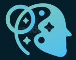

# Golnaz Berenjian Portfolio

 

<!-- 

  

 
  -->

  

## Description:
Welcome to my personal portfolio! My name is Golnaz Berenjian, and I am a full-stack developer with a passion for creating beautiful and functional websites. This portfolio showcases a range of my projects, skills, and experiences in web development.

 

## Technologies:

  &nbsp;
  &nbsp;
  &nbsp;
  &nbsp;
  &nbsp;
  &nbsp;
  &nbsp;
  &nbsp;

  

 

## Resources:

### Next.js

- [Next.js Official Website](https://nextjs.org/): Documentation, tutorials, and resources for Next.js.
- [Learn Next.js](https://nextjs.org/learn): Interactive learning experience for Next.js, suitable for all levels.

### Material UI

- [Material-UI Official Site](https://material-ui.com/): Official site for Material-UI, a React UI framework, with documentation and guides.
- [Material-UI GitHub Repository](https://github.com/mui-org/material-ui): Source code, issues, and contribution opportunities for Material-UI.

### Creative Tim Resources for UI Kit

- [Creative Tim Live Preview](https://demos.creative-tim.com/nextjs-material-dashboard-pro-material-ui-v4/admin/dashboard): Material 4 dashboard live preview.
- [Documentation](https://www.creative-tim.com/learning-lab/nextjs/overview/material-dashboard-material-ui-v4): Material 4 documentation.
- [License Agreement](https://www.creative-tim.com/license): Creative Tim License (Company License applies here)
- [Support](https://www.creative-tim.com/contact-us): Contact Create Tim
- [Github Issues Page](https://github.com/creativetimofficial/ct-nextjs-material-dashboard-pro-material-ui-v4/issues): Report UI Kit issues to Creative Tim
- [Nepcha Analytics](https://nepcha.com?ref=readme): Cookie free analytics tool for the website

 

## Browser Support:

At present, I officially aim to support the last two versions of the following browsers:

    

 

## 📫 Contact

📧 Want to collaborate or have any questions? Feel free to reach out to us through the following:

**Golnaz Berenjian**:

- **Github**: [@golnaz8](https://github.com/Golnaz8)
- **LinkedIn**: [@Golnaz Brj](https://www.linkedin.com/in/golnaz-brj/)
  

